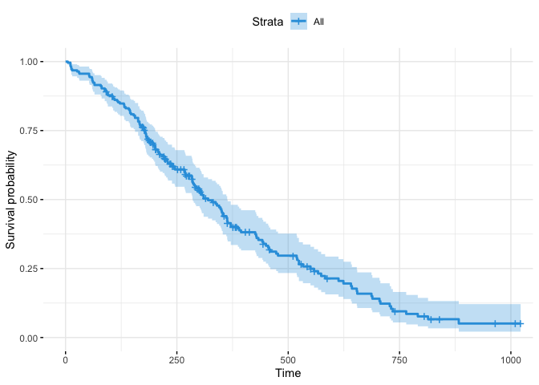
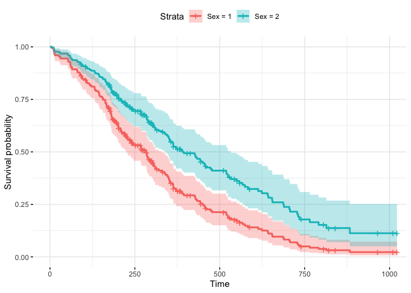

Cox\_Model\_example1
================
Rachel
5/18/2022

\#Two R packages: 1. ‘survival’ for computing survival analyses; 2.
‘survminer’ for visualizing survival analysis results

\#Load the packages

``` r
library("survival")
```

    ## Warning: package 'survival' was built under R version 4.1.2

``` r
library("survminer")
```

    ## Loading required package: ggplot2

    ## Loading required package: ggpubr

    ## 
    ## Attaching package: 'survminer'

    ## The following object is masked from 'package:survival':
    ## 
    ##     myeloma

\#Example

\#\#1. data:

``` r
data("lung")
```

    ## Warning in data("lung"): data set 'lung' not found

``` r
head(lung)
```

    ##   inst time status age sex ph.ecog ph.karno pat.karno meal.cal wt.loss
    ## 1    3  306      2  74   1       1       90       100     1175      NA
    ## 2    3  455      2  68   1       0       90        90     1225      15
    ## 3    3 1010      1  56   1       0       90        90       NA      15
    ## 4    5  210      2  57   1       1       90        60     1150      11
    ## 5    1  883      2  60   1       0      100        90       NA       0
    ## 6   12 1022      1  74   1       1       50        80      513       0

\#\#2. Compute the cox model: fit the Cox regression using covariates:
age, sex, ph.ecog and wt.loss.

    ##2.1 Univariate Cox regression: 

``` r
res.cox = coxph(Surv(time, status) ~ sex, data = lung)
res.cox
```

    ## Call:
    ## coxph(formula = Surv(time, status) ~ sex, data = lung)
    ## 
    ##        coef exp(coef) se(coef)      z       p
    ## sex -0.5310    0.5880   0.1672 -3.176 0.00149
    ## 
    ## Likelihood ratio test=10.63  on 1 df, p=0.001111
    ## n= 228, number of events= 165

``` r
summary(res.cox)
```

    ## Call:
    ## coxph(formula = Surv(time, status) ~ sex, data = lung)
    ## 
    ##   n= 228, number of events= 165 
    ## 
    ##        coef exp(coef) se(coef)      z Pr(>|z|)   
    ## sex -0.5310    0.5880   0.1672 -3.176  0.00149 **
    ## ---
    ## Signif. codes:  0 '***' 0.001 '**' 0.01 '*' 0.05 '.' 0.1 ' ' 1
    ## 
    ##     exp(coef) exp(-coef) lower .95 upper .95
    ## sex     0.588      1.701    0.4237     0.816
    ## 
    ## Concordance= 0.579  (se = 0.021 )
    ## Likelihood ratio test= 10.63  on 1 df,   p=0.001
    ## Wald test            = 10.09  on 1 df,   p=0.001
    ## Score (logrank) test = 10.33  on 1 df,   p=0.001

\#\#To apply the univariate coxph function to multiple covariates at
once, type this:

``` r
covariates = c("age", "sex", "ph.karno", "ph.ecog", "wt.loss")
univ_formulas = sapply(covariates, 
                       function(x) as.formula(paste('Surv(time, status)~', x)))

univ_models = lapply(univ_formulas, function(x){coxph(x, data = lung)})

#Extract data: 

univ_results = lapply(univ_models, function(x){
                                      x = summary(x)
                                      p.value = signif(x$wald["pvalue"], digits = 2)
                                      wald.test = signif(x$wald["test"], digits = 2)
                                      beta = signif(x$coef[1], digits = 2); #coeficient beta
                                      HR = signif(x$coef[2], digits = 2); #exp(beta)
                                      HR.confint.lower = signif(x$conf.int[, "lower .95"], 2)
                                      HR.confint.upper = signif(x$conf.int[, "upper .95"], 2)
                                      HR = paste0(HR, "(", 
                                                  HR.confint.lower, "-", HR.confint.upper,")")
                                      res = c(beta, HR, wald.test, p.value)
                                      names(res) = c("beta", "HR(95% CI for HR)", "wald.test", "p.value")
                                      return(res)
                                        ##returen(exp(cbind(coef(x), confint(X))))
})

res = t(as.data.frame(univ_results, check.names = FALSE))
as.data.frame(res)
```

    ##            beta HR(95% CI for HR) wald.test p.value
    ## age       0.019            1(1-1)       4.1   0.042
    ## sex       -0.53   0.59(0.42-0.82)        10  0.0015
    ## ph.karno -0.016      0.98(0.97-1)       7.9   0.005
    ## ph.ecog    0.48        1.6(1.3-2)        18 2.7e-05
    ## wt.loss  0.0013         1(0.99-1)      0.05    0.83

\#\#Multivariate Cox regression analysis

``` r
res.cox = coxph(Surv(time, status) ~ age + sex + ph.ecog, data = lung)
summary(res.cox)
```

    ## Call:
    ## coxph(formula = Surv(time, status) ~ age + sex + ph.ecog, data = lung)
    ## 
    ##   n= 227, number of events= 164 
    ##    (1 observation deleted due to missingness)
    ## 
    ##              coef exp(coef)  se(coef)      z Pr(>|z|)    
    ## age      0.011067  1.011128  0.009267  1.194 0.232416    
    ## sex     -0.552612  0.575445  0.167739 -3.294 0.000986 ***
    ## ph.ecog  0.463728  1.589991  0.113577  4.083 4.45e-05 ***
    ## ---
    ## Signif. codes:  0 '***' 0.001 '**' 0.01 '*' 0.05 '.' 0.1 ' ' 1
    ## 
    ##         exp(coef) exp(-coef) lower .95 upper .95
    ## age        1.0111     0.9890    0.9929    1.0297
    ## sex        0.5754     1.7378    0.4142    0.7994
    ## ph.ecog    1.5900     0.6289    1.2727    1.9864
    ## 
    ## Concordance= 0.637  (se = 0.025 )
    ## Likelihood ratio test= 30.5  on 3 df,   p=1e-06
    ## Wald test            = 29.93  on 3 df,   p=1e-06
    ## Score (logrank) test = 30.5  on 3 df,   p=1e-06

\#\#Visualizing the estimated distribution of survival times \#Plot the
baseline survival function

``` r
ggsurvplot(survfit(res.cox), data = lung, palette = "#2E9FDF",
          ggtheme = theme_minimal())
```

<!-- -->

\#Create the new data

``` r
sex_df = with(lung, data.frame(sex = c(1,2),
                               age = rep(mean(age, na.rm = TRUE), 2),
                               ph.ecog = c(1,1)
                               )
              )
sex_df
```

    ##   sex      age ph.ecog
    ## 1   1 62.44737       1
    ## 2   2 62.44737       1

\#\#Survival Curves

``` r
fit = survfit(res.cox, newdata = sex_df)
ggsurvplot(data = lung, fit, conf.int = TRUE, legend.labs = c("Sex = 1", "Sex = 2"),
           ggtheme = theme_minimal())
```

<!-- -->
